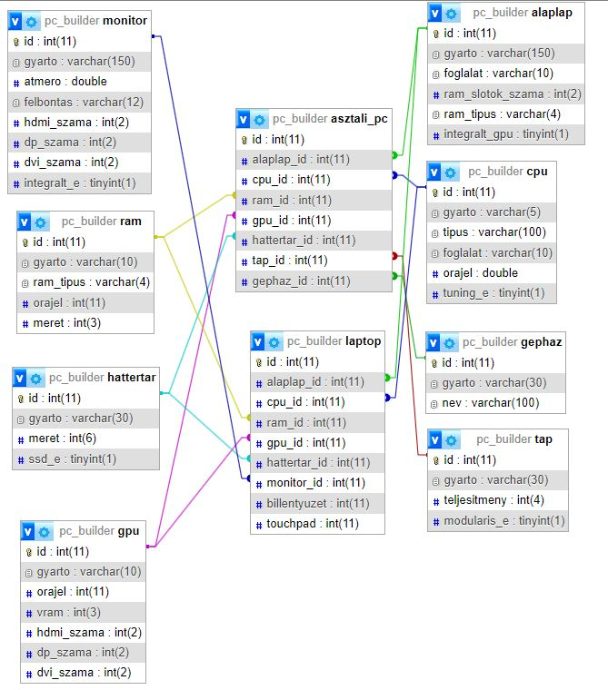

# Rendszerterv

## 1. A rendszer célja 
Az alkalmazás célja egy PC összerakó szimulátor. A felhasználó képes számítógépet összerakni bizonyos megkötések mellett (kompatibilitás).
Az adatbázisban tárolódik a felhasználó által összerakott gép külön komponensenként.

## 2. Projecktterv
A projekt Java-ban lesz fejlesztve bizonyos tervezési minták használatával és azok komoly betartásával. Az adatbázissal való csatlakozás során Command tervezési mintát fogunk használni.

## 3. Követelmények

+ Az alap adatbázis adatainak a megfelelő tárolása
+ Az adatok közti összefüggés vizsgálata
+ Asztali környezetben való futás
+ A program megfelelő vissza jelzése a felhasználó felé

## 4. Fejlesztő eszközök

- Visual Studio Code 
- IntelliJ Idea Ultimate
- XAMPP
- MySql

## 5. Adatbázis terv

## 6. Tesztterv

A program tesztelése unit tesztek sorozatán keresztül fog lezajlani (JUnit) manuális teszttel együtt

## 7. Telepítési terv

Az alkalmazás egy sima telepítővel lehet majd feltelepíteni a gépekre.
